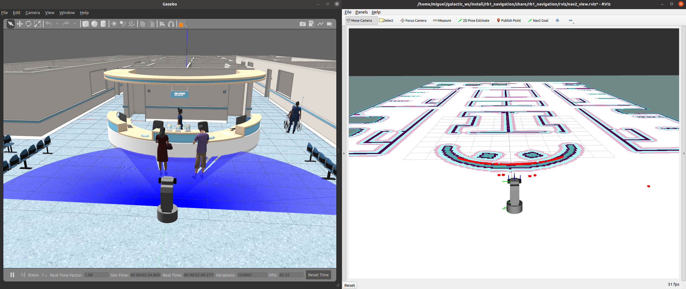

# ros2_rb1_sandbox

RB1 simulation with several Gazebo worlds.

## Installation

```shell
$ cd ~/ros2_ws/src
$ git clone --recurse-submodules git@github.com:mgonzs13/ros2_rb1_sandbox.git
$ colcon build
$ GAZEBO_MODEL_PATH=$GAZEBO_MODEL_PATH:~/ros2_ws/install/aws_robomaker_hospital_world/share/aws_robomaker_hospital_world/fuel_models/
```

## Usage

- AWS Bookstore

```shell
$ ros2 launch rb1_sandbox bookstore.launch.py
```


- AWS Small House

```shell
$ ros2 launch rb1_sandbox small_house.launch.py
```


- AWS Small Warehouse

```shell
$ ros2 launch rb1_sandbox small_warehouse.launch.py
```


- AWS Hospital

```shell
$ ros2 launch rb1_sandbox hospital.launch.py
```


